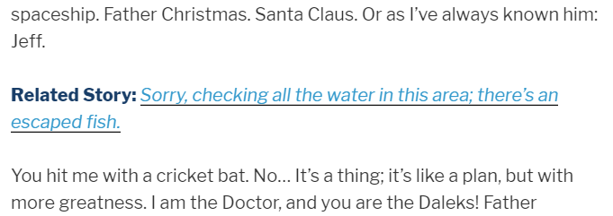
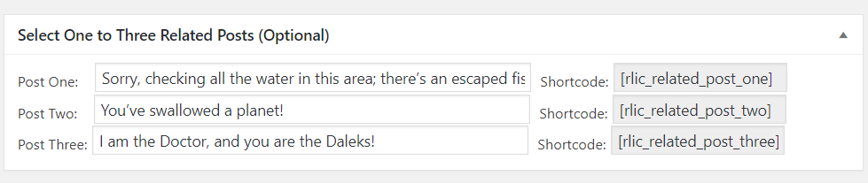
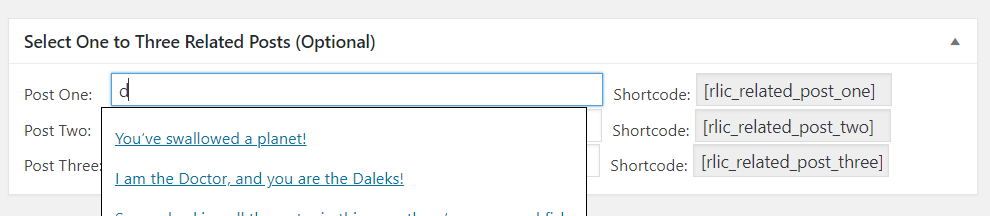

# Related Links Inside Content

A wordpress plugin to add related post or page links inside post or page content.

- Contributors: trqnwr
- Donate link: paypal.me/trqnwr
- Tags: related post, related link, related story
- Requires at least: 3.3
- Tested up to: 4.0
- Stable tag: 1.0
- License: GPLv2 or later
- License URI: http://www.gnu.org/licenses/gpl-2.0.html

## Description

Search and add your related post links directly inside your posts using the shortcode. When you are adding a new post or editing a post, you will see a custom panel named "Select One to Three Related Posts (Optional)". There you can search posts related to your current post and select the one you want. Then copy and paste the relevant shortcode into your post where you want to show the link. This will show that link in your post.

## Installation

1. Upload `related-links-inside-content.zip` to the `/wp-content/plugins/` directory
2. Extract the zip file there
3. Activate the plugin through the 'Plugins' menu in WordPress

# Frequently asked questions

### How will I add a related link inside post?

Go to add post or edit post page. You will see a custom post box named "Select One to Three Related Posts (Optional)". You can search your related posts on the three input fields there. You don't have to use all three of them everytime. You can use as much links as you want. Just copy the shortcode from next input field inside your post content. You see the related story link in your output.

### Can I add more than three links?

For now, you can add up to three links. I have plan make it dynam, users will be able to add as many links as they want.

### Can I change the "Related Story" text from output?

I have plan to add the customization features in next versions.

## Screenshots

#### Related story link inside post

#### "Select One to Three Related Posts (Optional)" box inside add or edit new post/page

#### Search output

## Changelog
- 1.0 
  * Initial Release

## Upgrade notice