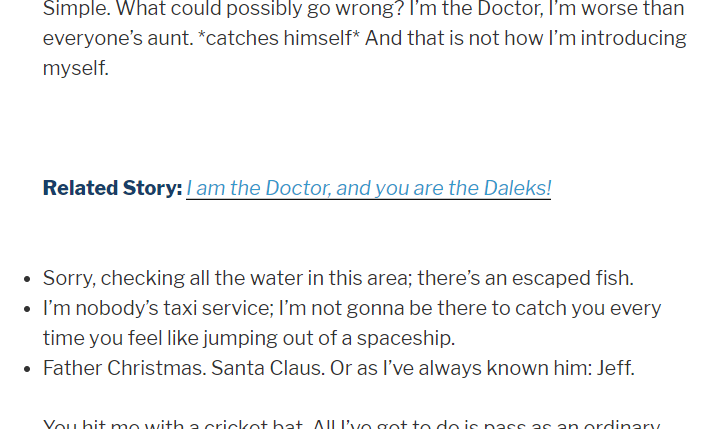

# Related Links Inside Content

Search and add your related post links directly inside your posts using the shortcode. When you are adding a new post or editing a post, you will see a custom panel named "Select One to Three Related Posts (Optional)". There you can search posts related to your current post and select the one you want. Then copy and paste the relevant shortcode into your post where you want to show the link. This will show that link in your post.

## Screenshot
